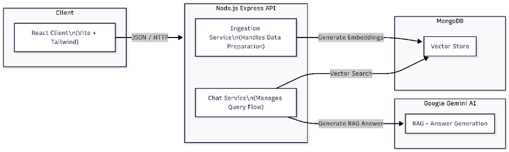

# 🤖 Smart Customer Support Chatbot (RAG Edition)

Hi there! Welcome to your new **Smart Customer Support Chatbot**. 

This isn't just a regular chatbot—it's built with a "brain" that reads your specific documents (in this case, Cimba.AI FAQs) before answering. It uses **Google's Gemini AI** to understand what you're asking and **MongoDB Vector Search** to find the exact right information to fetch. This technique is called *Retrieval-Augmented Generation*, or **RAG** for short.

It helps you avoid generic AI hallucinations by grounding every answer in your actual company data.

---

## 🏗️ System Architecture



This diagram illustrates how the **React Frontend**, **Node.js Backend**, and external services (**MongoDB** & **Google Gemini**) interact to process your queries.

---

## 🛠️ What You Need to Run This

Before we jump in, make sure you have these three things ready:

1.  **Node.js installed**: This runs the code on your computer.
2.  **A Google Gemini API Key**: You can grab one for free at [Google AI Studio](https://aistudio.google.com/).
3.  **A MongoDB Atlas Database**: This is where we store your FAQs and their "vector embeddings" (math representations of the text).

---

## 🚀 Setting Up the Project

We've split the project into two parts: the **Backend** (the brain) and the **Frontend** (the beautiful interface).

### Step 1: Prepare the Brain (Backend)

1.  Open your terminal and jump into the backend folder:
    ```bash
    cd backend
    ```
2.  Install the necessary tools:
    ```bash
    npm install
    ```
3.  **The Secret Keys**:
    Create a file named `.env` in the `backend` folder and add your keys like this:
    ```env
    PORT=5000
    MONGO_URI=mongodb+srv://<youruser>:<password>@<yourcluster>.mongodb.net/?appName=project
    API_KEY=AIzaSy...<Your_Gemini_Key_Here>
    ```

### Step 2: Prepare the Face (Frontend)

1.  Open a **new** terminal window and go to the frontend folder:
    ```bash
    cd frontend
    npm install
    ```

---

## 🔑 Crucial Step: The MongoDB Vector Index

This is the most important part! For the AI to search your data, MongoDB needs a special map called a "Vector Index".

1.  Log in to your **MongoDB Atlas** dashboard.
2.  Go to your cluster and click the **"Atlas Search"** tab.
3.  Click **"Create Search Index"**.
4.  Choose **"JSON Editor"**.
5.  Select your database and the collection (likely `test.faqs` or `support_bot.faqs` depending on your URI).
6.  Name the index: `vector_index`.
7.  Paste this **exact** configuration and hit Create:
    ```json
    {
      "mappings": {
        "dynamic": true,
        "fields": {
          "embedding": {
            "type": "knnVector",
            "dimensions": 768,
            "similarity": "cosine"
          }
        }
      }
    }
    ```
    *Why 768? That's the specific "size" of the embeddings our AI model uses!*

---

## 🏁 How to Run It

You need to run two servers at the same time (one for the visual part, one for the logic).

**Terminal 1 (Backend):**
```bash
cd backend
npm run dev
```
*You should see: "MongoDB Connected" & "Server running on port 5000"*

**Terminal 2 (Frontend):**
```bash
cd frontend
npm run dev
```

Now, open your browser and go to: **[http://localhost:3000](http://localhost:3000)**

---

## 🎮 How to Use It

1.  **Teach the Bot**: When you first load the page, the brain is empty! Click the **Database Icon** (or "Ingest" button) in the top right corner.
    *   *What happens?* It clears the old memory and learns the new FAQs about Cimba.AI effectively instantly.
2.  **Ask Away**: Try questions like:
    *   "What is Cimba.AI?"
    *   "How does security work?"
    *   "Can non-technical people use this?"
3.  **Watch it Think**: You'll see the bot search, find the context, and write you a perfect answer.

---

## ❓ Troubleshooting

*   **"I get a 500 Error when chatting":** Check your `backend` terminal. Did the API Key fail? Is the Model name correct?
*   **"The bot implies it doesn't know the answer":** Did you click the Ingest button? If yes, check your MongoDB Index. It must reference the `embedding` content containing **768** dimensions.
*   **"Connection Refused":** Make sure both terminals are running!

Enjoy building your AI assistant! ✨
